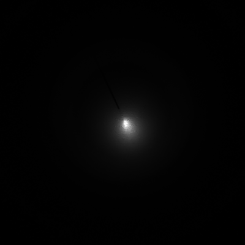

# Rapid Needle Tip Tracking Using Convolutional Neural Network from Scattering Images

Paper [Needle Tip Tracking by Scattering Imaging] is submitted to [CRAS 2023](https://cras-eu.org/)

## Abstract
Medical needle tip tracking plays an important role in various needle-based procedures such as biopsy, tumor ablation, intravenous access and deep brain stimulation. 

Accurate and real-time tracking of the needle tip assures precise targeting, minimizing tissue damage and   enhance procedural efficiency.

# Data Acquisition

The proposed system incorporates a fiber optic needle and a camera for achieving the needle tip tracking task

A fiber optic needle is made by insertion an optic fiber inside the needle lumen with the exposed end of the optic fiber at the needle tip.

A 850 nm lighting source is used. Additionally, a camera with a corresponding 850 nm filter is placed 60 mm above the phantom surface. 

The exposure time of the camera is set to 20 ms. During the acquisition of data, ambient light has been removed. 

As a proof-of-concept study, a rubber phantom (TruIV block) is used.

Two datasets were used; One is an image file , the other csv file which contains ground truth x,y,z values. 

Before putting data we have into networks, let's check how data looks like

Images file look like this

## 

CSV files contain values as below

| **_-0.9408676147460938_** | **_0.5140417665243149_** | **_5.389111146330833_** | 0.9238641858100891 | 0.24476052820682526 | -0.26966384053230286 | 0.1176803708076477 |
|---------------------------|--------------------------|-------------------------|--------------------|---------------------|----------------------|--------------------|

# 1. Data Pre-Processing

Among various pre-processing methods, Normalization focused on leveraging the structural information inherent in the images, 

specifically their position category to guide the normalization process  is used The position category consists of three key-value pairs (x,y,z) 

that represent the spatial dimensions. Each key provides information about the data range and the corresponding normalization range

| Position | Data Range (cm) | Normalization Range |
|:--------:|:---------------:|:-------------------:|
|  **_x_** |   [-8.3, 8.3]   |        [-1,1]       |
|  **_y_** |   [-5.5, 5.5]   |        [-1,1]       |
|  **_z_** |     [0. 6.5]    |        [-1,1]       |

And only first three values from original csv files  are needed. Also, for the better computation, after extracting the first three values (x,y,z), added header x,y,z 

|       **_x_**       |       **_y_**      |      **_z_**      |
|:-------------------:|:------------------:|:-----------------:|
| -0.9408676147460938 | 0.5140417665243149 | 5.389111146330833 |

# 2. Model

Due to the lack of the number of data, the model is somewhat simple, light-weight yet powerful. Also, Attention layer is added (here in this repo, attention layer is commented) 

# 3. Application

To avoid Over-fitting during the training, AdamW and Early-Stopping have been applied 

# 4. Result

This model achieved a promising result as shown in the table below 

|         | **_Accuracy & Standard Deviation (mm)_** |
|:-------:|:----------------------------------------:|
| **_x_** |              1.7337 ± 1.3029             |
| **_y_** |              2.0283 ± 1.6948             |
| **_z_** |              2.7550 ± 1.9911             |
| L2-Norm |              3.8337 ± 2.1074             |
